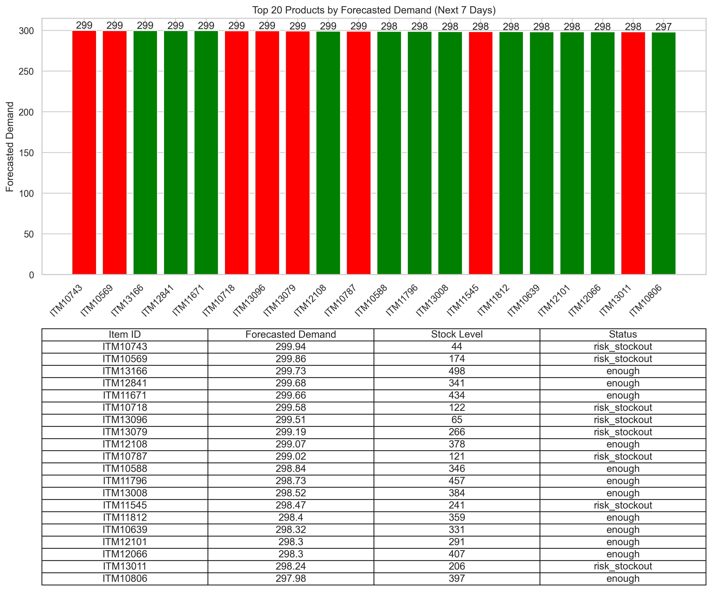
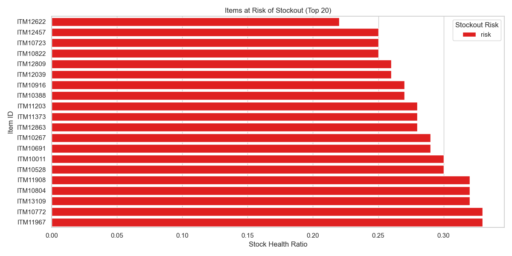
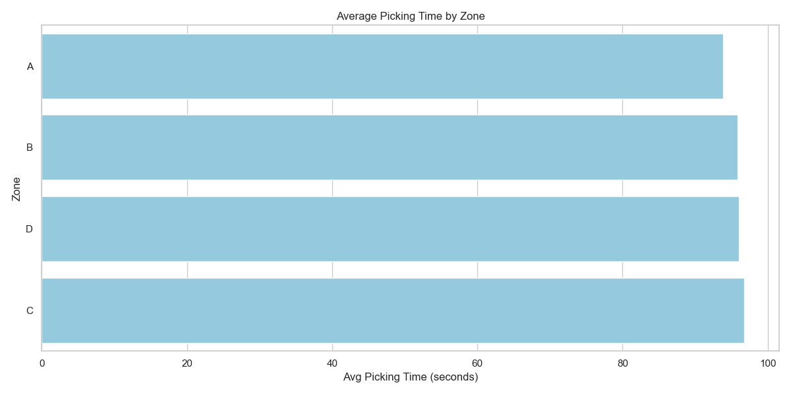
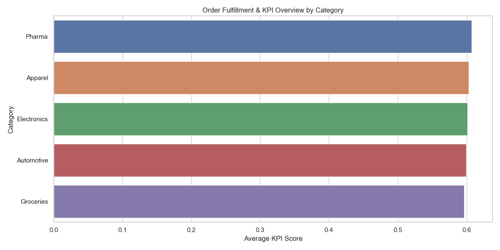
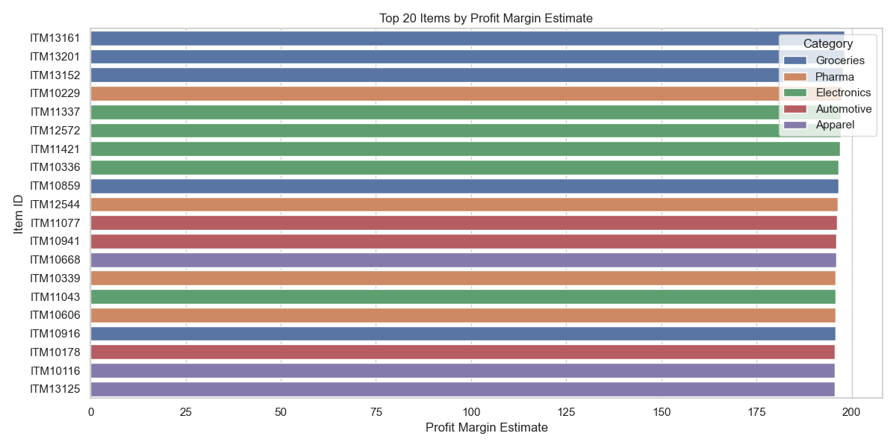

# Warehouse Data Analysis (SQL + Python)

**What it does:**  
Analyze warehouse data from **Google BigQuery** and generate **5 key charts** to understand inventory and product demand trends.
---

## Charts Included
1. Top 20 Products by Forecasted Demand


2. Items at Risk of Stockout


3. Average Picking Time by Zone


4. Order Fulfillment & KPI Overview by Category  


5. Top 20 Items by Profit Margin Estimate


## How to Run
`1.` Clone repo:  
`git clone https://github.com/tuyettran15999/warehouse-dashboard-python.git
cd warehouse-dashboard-python`

`2.` Install packages:
`pip install -r requirements.txt`

`3.` Set Google Cloud credentials:
`export GOOGLE_APPLICATION_CREDENTIALS="path/to/credentials.json"` 

`4.` Run:
`python warehouse.py` 
Charts will appear and also be saved in charts_output/.


```markdown
## What’s Inside

- `python_code/` → main code  
- `charts_output/` → generated charts  
- `raw_data/` → optional CSVs
